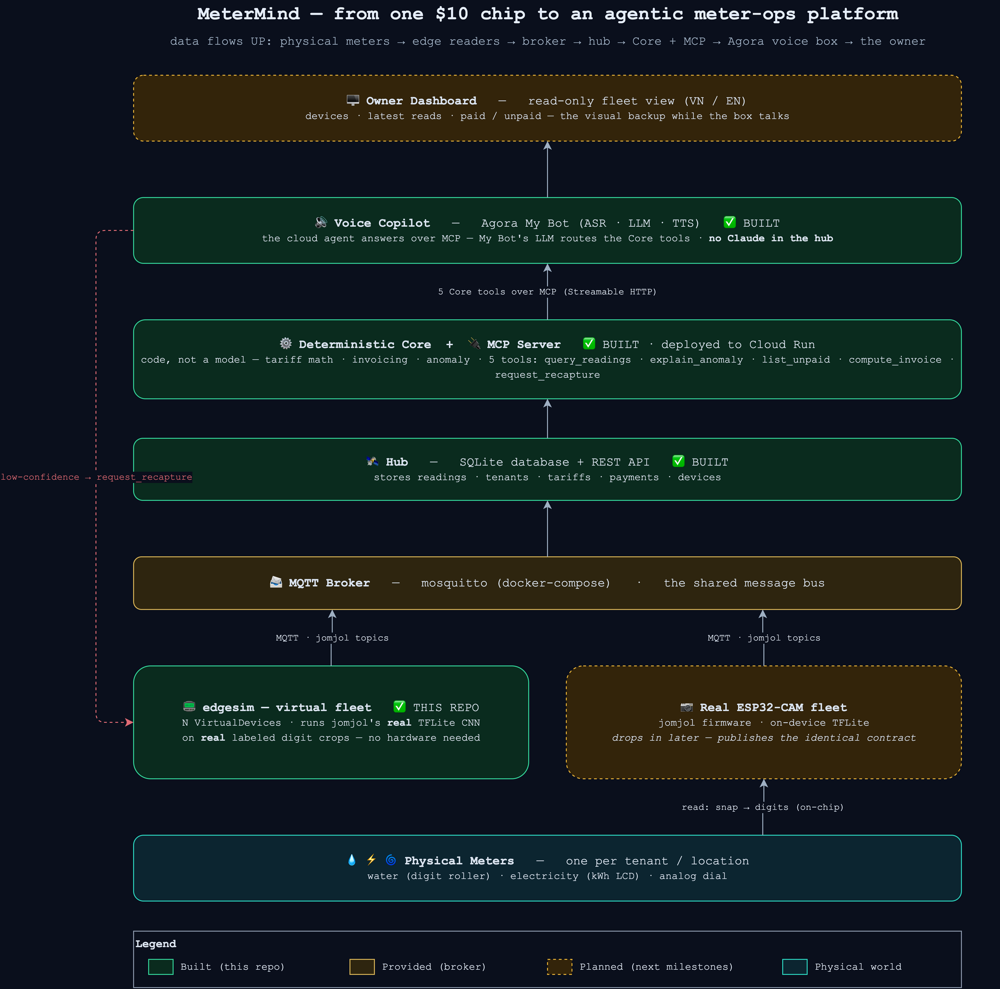
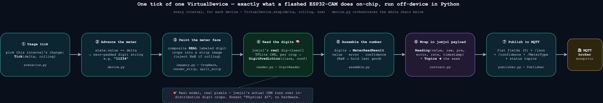
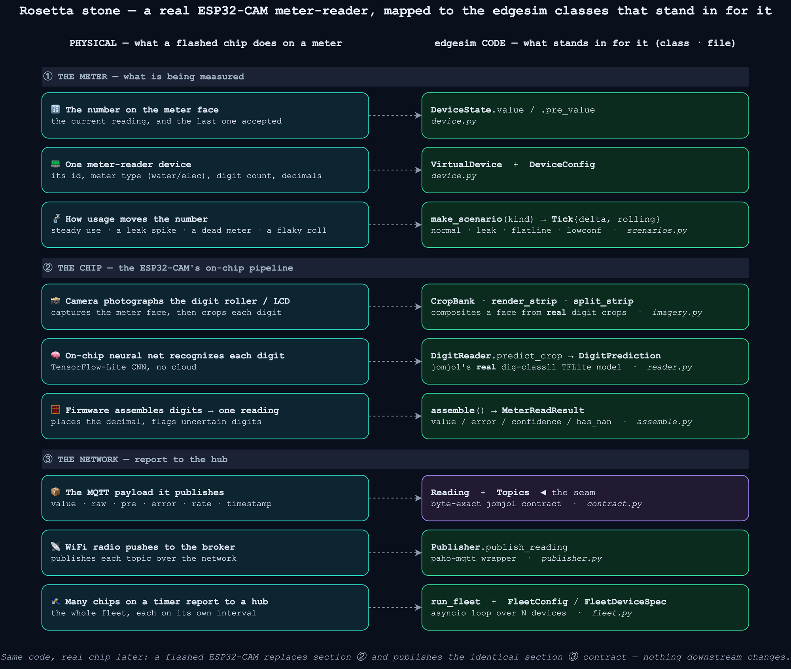
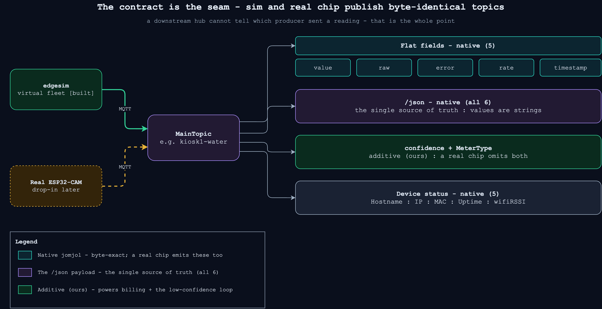

# 🔌 MeterMind

**Turn a fleet of $10 camera-on-a-chip meter readers into an agentic operations copilot.**

A landlord with meters scattered across many units spends hours every month walking around, photographing dials, typing numbers into a spreadsheet, computing bills, and chasing late payers. MeterMind is the software that does all of that automatically — starting from the cheapest possible sensor and ending at a voice box the owner can *ask* (in Vietnamese or English) *"who hasn't paid?"*.

|  |  |
|---|---|
| **Event** | Agentic AI Build Week (AABW) — HCMC, July 2026 · Track: Robotics & Physical AI |
| **Foundation** | [jomjol AI-on-the-edge-device](https://github.com/jomjol/AI-on-the-edge-device) — a ~$10 ESP32-CAM that reads a meter on-chip |
| **Built** | `edgesim` (virtual jomjol fleet) **+ the hub** — deterministic Core, SQLite, REST API, an **MCP server on Cloud Run** for Agora's voice box, and a live **owner dashboard** on the same service |
| **Demo** | **Live** → [meter-mind-mcp…run.app](https://meter-mind-mcp-fkoupnt5ua-as.a.run.app/) (dashboard at `/`, Agora bot at `…/mcp`) · [`assets/demoVideo.mp4`](assets/demoVideo.mp4) — walkthrough |
| **Stack** | Python 3.12 · `uv` · `ai-edge-litert` (TFLite) · `paho-mqtt` · `pydantic` v2 · `pillow` · `pyyaml` · `fastapi` · `sqlmodel` · `mcp` (FastMCP) |

---

## The big picture

The base sensor **senses** — it reads one meter and shouts a number over WiFi. It doesn't **reason** or **act**. MeterMind adds everything above the sensor: a hub to collect readings, a deterministic core to do the billing math, an AI copilot to answer questions and handle exceptions, and an owner-facing UI. Data flows *up* — from the physical meter to the human.



> **Status — what's actually built.** **`edgesim`** (the green producer box) is a Python fleet that emits byte-exact jomjol readings, so the rest of the stack builds against a realistic data stream today with **zero hardware** (the mosquitto broker is provided via Docker). **The hub is built too:** a deterministic **Core** (tariff math, invoicing, anomaly detection — *code, no model*), a **SQLite** store, a **REST API**, and an **MCP server deployed to Cloud Run** exposing the five demo tools. The **Agora voice copilot** is built too: the My Bot ConvoAI cloud agent answers over those MCP tools — *no Claude anywhere in the hub*. Still to come (the dashed boxes): the **owner dashboard**, and a real ESP32-CAM that drops in later as one more producer on the same contract.

---

## Why simulate first?

Hardware isn't on the critical path for a 5-day build. So instead of waiting on chips, `edgesim` stands in for the ESP32-CAM fleet — but it does the honest thing at every step:

- **Real model.** It runs jomjol's *actual* `dig-class11` TensorFlow-Lite CNN — the same network that runs on the chip — just off-device, in Python.
- **Real pixels.** It builds each meter image by compositing **real labeled digit crops** from jomjol's training set, so the CNN sees in-distribution photos, not synthetic fonts.
- **Real contract.** It publishes the **exact** jomjol MQTT topics and `/json` body. A downstream consumer cannot tell a simulated device from a real chip.

That last point is the whole design: **the contract is the seam.** Build the entire platform against the simulator now; swap in real hardware later with no downstream changes.

---

## How one reading is produced

Every interval, each virtual device runs the same chain a flashed ESP32-CAM runs on-chip. `VirtualDevice.step()` in `device.py` orchestrates it:



1. **Usage tick** — the device's `Scenario` picks this interval's change (`scenarios.py`).
2. **Advance the meter** — the running value moves by that delta and becomes a zero-padded digit string.
3. **Paint the meter face** — real digit crops are composited into a strip image; if the reading is mid-roll, a `NaN` crop is injected (`imagery.py`).
4. **Read the digits** — jomjol's real CNN classifies each digit and returns a softmax confidence (`reader.py`).
5. **Assemble the number** — digits become one validated reading; an uncertain digit flags an error and holds the last good value (`assemble.py`).
6. **Wrap in the jomjol payload** — the reading is packaged as the exact wire format (`contract.py`).
7. **Publish to MQTT** — flat per-field topics, the `/json` body, plus our additive topics, go to the broker (`publisher.py`).

---

## Connecting the concepts: physical device ⟷ code

If you know how the ESP32-CAM works but not the code (or vice-versa), this is the map. Each thing a real chip does on a meter corresponds to a specific edgesim class.



| A real ESP32-CAM… | …is simulated by | in |
|---|---|---|
| The number on the meter face (current + last accepted) | `DeviceState.value` / `.pre_value` | `device.py` |
| One meter-reader device (id, type, digits, decimals) | `VirtualDevice` + `DeviceConfig` | `device.py` |
| How usage moves the number (steady / leak / dead / flaky) | `make_scenario(kind, seed)` → `Tick{delta, rolling}` | `scenarios.py` |
| Camera photographs the digit roller / LCD | `CropBank` · `render_strip` · `split_strip` | `imagery.py` |
| On-chip neural net recognizes each digit | `DigitReader.predict_crop` → `DigitPrediction` | `reader.py` |
| Firmware assembles digits into one reading | `assemble()` → `MeterReadResult` | `assemble.py` |
| The MQTT payload it publishes | `Reading` + `Topics` ◀ **the seam** | `contract.py` |
| WiFi radio pushes to the broker | `Publisher.publish_reading` | `publisher.py` |
| Many chips on a timer reporting to a hub | `run_fleet` + `FleetConfig` | `fleet.py` |

---

## The MQTT contract (the seam)

Both the simulator and a real chip publish under a per-device **`MainTopic`** (e.g. `kiosk1-water`), with a message **`group`** that defaults to `main`. The consumer treats both producers identically.



**Topics published for one device** (`MainTopic` = `kiosk1-water`):

| Topic | Kind | Notes |
|---|---|---|
| `kiosk1-water/main/value` `…/raw` `…/error` `…/rate` `…/timestamp` | Native jomjol — flat (5) | one topic per field. **There is no flat `/pre`** — `pre` lives only in `/json`. |
| `kiosk1-water/main/json` | Native jomjol — the source of truth | the full 6-field payload (below). |
| `kiosk1-water/main/confidence` | **Additive (ours)** | CNN softmax confidence, 4-decimal string. A real chip omits this. |
| `kiosk1-water/MeterType` | **Additive (ours)** | `water` / `electricity`. A real chip omits this. |
| `kiosk1-water/Hostname` `/IP` `/MAC` `/Uptime` `/wifiRSSI` | Native jomjol — status | device health. |

**The `/json` body** — byte-exact jomjol, fixed key order, every value a string:

```json
{"value":"11.234","raw":"11.234","pre":"10.000","error":"no error","rate":"1.234000","timestamp":"2026-06-27T10:00:00"}
```

- `value` — the validated reading (the number to trust). `raw` — the uncorrected OCR result. `pre` — the previous accepted value (basis for `rate`).
- `error` is the literal string `"no error"` when clean, otherwise the rejection reason. Treat it as **free text**; only `"no error"` means clean.
- `rate` is emitted as a **string** here (jomjol's firmware does the same), though jomjol's docs show it as a number — a consumer must tolerate both.

The tolerance rules that let a real chip and the simulator share one broker (local planning notes): additive topics are optional, unknown topics are ignored, `error` is free text, and values are compared with tolerance — not byte-for-byte.

---

## The demo scenarios

Each device is driven by a scripted usage profile (`scenarios.py`) so a demo shows the interesting cases, not just steady counting:

| Scenario | Behaviour | Demonstrates |
|---|---|---|
| `normal` | small random increments; ~10% mid-roll frames | a healthy meter |
| `leak` | normal for a few ticks, then a large sustained spike | anomaly / leak detection |
| `flatline` | value never changes | a broken or stuck meter |
| `lowconf` | ~70% mid-roll frames → frequent `NaN` reads | the **low-confidence escalation loop** the agent will handle |

---

## Project layout

```
meter-mind/
├── src/edgesim/
│   ├── contract.py    # Reading + Topics — THE jomjol MQTT contract (the seam)
│   ├── reader.py      # DigitReader → DigitPrediction (jomjol's real TFLite CNN)
│   ├── assemble.py    # assemble() → MeterReadResult (digits → value/error/confidence)
│   ├── imagery.py     # CropBank, render_strip, split_strip (composite a meter face)
│   ├── device.py      # VirtualDevice — state → image → read → payload
│   ├── scenarios.py   # make_scenario → Tick (normal/leak/flatline/lowconf)
│   ├── publisher.py   # Publisher — paho-mqtt wrapper (flat + /json + status)
│   ├── fleet.py       # run_fleet — asyncio scheduler over N devices + YAML config
│   └── cli.py         # `edgesim run --config fleet.yaml`
├── src/hub/                # the ops layer above the sensor
│   ├── core/
│   │   ├── contract.py     # FROZEN Core contract — the 5 tools' return models
│   │   ├── service.py      # deterministic Core: usage, invoicing, spike detection (no model)
│   │   └── seed.yaml        # demo dataset (leak on kiosk 3, unpaid tenants)
│   ├── db/                 # SQLModel tables + idempotent seed loader (SQLite)
│   ├── api.py              # FastAPI REST — reads for the dashboard + a recapture POST
│   └── mcp_server.py       # FastMCP streamable-http /mcp — the 5 tools Agora calls
├── scripts/fetch_assets.py   # download jomjol model + digit crops into data/
├── tests/                    # pytest — one file per module + a contract test
├── data/                     # (fetched) dig-class11 model + labeled digit crops
├── fleet.example.yaml        # example fleet: 3 kiosks (normal/leak/lowconf)
├── docker-compose.yml        # mosquitto broker
└── justfile                  # task runner
```

Every object that crosses a module boundary is a **Pydantic v2** model — `Reading`, `DigitPrediction`, `MeterReadResult`, `Tick`, `DeviceConfig`, `FleetConfig`, and friends — so the data shapes are validated at every seam.

---

## Quickstart

Prerequisites: [`uv`](https://docs.astral.sh/uv/), [`just`](https://github.com/casey/just), and Docker (for the broker).

```bash
just init            # uv sync + install pre-commit hooks
just fetch-assets    # download jomjol's TFLite model + digit crops into data/
just broker-up       # start the mosquitto MQTT broker (docker-compose)

# run the virtual fleet against the broker
uv run edgesim run --config fleet.example.yaml
# ...or bounded, for a quick check:
uv run edgesim run --config fleet.example.yaml --max-ticks 20
```

Watch the readings on the wire in another terminal:

```bash
mosquitto_sub -t '#' -v      # every topic from every device
```

Other tasks:

```bash
just test            # run the test suite
just check           # everything CI runs: lint + types + tests
just broker-down     # stop the broker
```

### Configuring the fleet

`fleet.example.yaml` describes the broker and one entry per device:

```yaml
broker_host: localhost
broker_port: 1883
interval_seconds: 3.0
model_path: data/models/dig-class11_1701_s2.tflite
digits_dir: data/digits
devices:
  - device_id: kiosk1
    main_topic: kiosk1-water     # becomes the MQTT MainTopic
    meter_type: water
    n_digits: 5
    decimals: 3
    start_value: 10.0
    scenario: normal             # normal | leak | flatline | lowconf
  # ...more devices
```

Adding a device is one YAML block. A real ESP32-CAM joins the same fleet by setting its `MainTopic` in the jomjol web UI to match your naming convention — no code change.

---

## Testing & CI

Tests live in `tests/`, one file per module, and **call the production code paths directly** (no shims). CI runs three secret-free jobs:

- **contract** — lint (`ruff`) + type-check (`pyrefly`) + the jomjol JSON/topic contract test. Needs no downloaded assets, runs in seconds.
- **unit** — fetches the TFLite model + digit crops (cached), then runs the full suite. Reader tests skip gracefully if the fetch is flaky, so the job stays green either way.
- **e2e** — spins up the docker-compose mosquitto broker and runs the MQTT integration test (`test_integration_mqtt.py`, marked `@pytest.mark.integration`) **over the wire**: a real subscriber on a real broker receives a device's readings and asserts the byte-exact `/json` key order, the 5 flat fields (no flat `/pre`), and the additive `confidence`/`MeterType` topics. This is the test that actually **proves the seam** — the exact bytes a downstream hub (or a flashed ESP32-CAM) will see.

Run the E2E test locally with the broker up: `uv run pytest -m integration`.

---

## The ops layer above the sensor

The simulator is the producer side. The differentiator — the agentic ops layer — is largely built.

**Built (on `main`):**

- **Hub Core** — tariff math, invoicing, payment status, threshold anomaly detection. *Code, not a model* — anything a `match`/`if` can answer.
- **SQLite store** — readings · tenants · tariffs · payments · devices, seeded to drive the demo.
- **REST API + MCP server** — the five demo tools (`query_readings`, `explain_anomaly`, `list_unpaid`, `compute_invoice`, `request_recapture`), served over Streamable HTTP and **deployed to Cloud Run**.
- **Agora cloud agent** — My Bot ConvoAI wired to the MCP endpoint; it already answers the demo questions over the five tools (verified in the voice studio).
- **Owner dashboard** — a live, read-only page served at `/` on the **same Cloud Run service** as `/mcp` (the judge-clickable **Demo URL**): fleet cards, the kiosk-3 usage spike, billing (270k / 1.86M), a recapture button, and the embedded demo video. Reads the same baked DB as the bot, so it can't drift from the voice answers.

> **Where's the brain? Not in the hub.** The signed-off architecture is **Agora-only, zero Claude in the hub** ([`docs/arch.md`](docs/arch.md)). Agora's My Bot LLM does all the routing and phrasing over MCP; every Core tool — including `explain_anomaly` — is **deterministic code** (the detector computes the spike factor; the tool returns a fixed sentence around it). The MCP endpoint is the second seam: Track B just points the voice box at one URL, nothing is flashed to the device.

**Next:**

- **Live ingest** — edgesim → hub DB over MQTT (stretch; the demo runs off seed data + Core, not the live pipe).
- **Hardware** — flash a real ESP32-CAM and point it at the same broker.

---

## Credits

Built on [**jomjol/AI-on-the-edge-device**](https://github.com/jomjol/AI-on-the-edge-device) (the ESP32-CAM firmware + `dig-class11` model) and its [digit dataset](https://github.com/jomjol/neural-network-digital-counter-readout). The original brainstorm lives in [`docs/idea.md`](docs/idea.md). Diagram sources (`.drawio`) are in [`assets/diagrams/`](assets/diagrams/).
