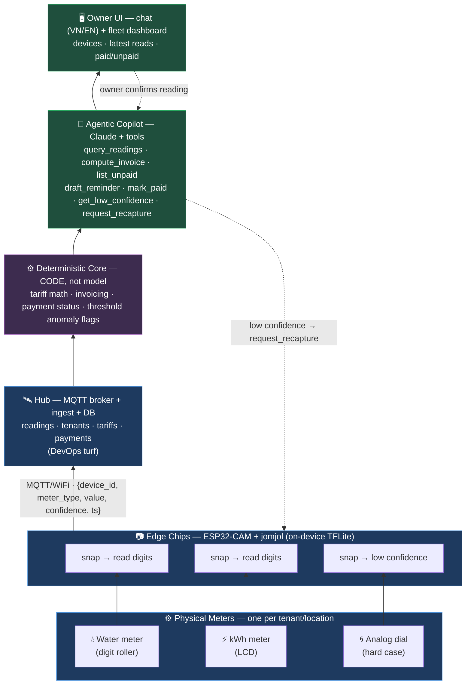
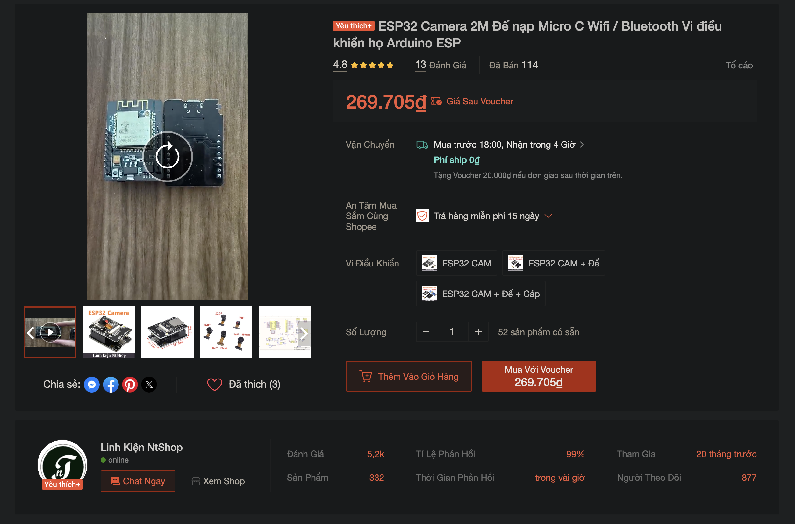

# IDEA.md — Agentic Edge Meter Fleet

> Brainstorm capture for **Agentic AI Build Week (AABW)** — HCMC, July 8–12, 2026.
> Track: **Robotics & Physical AI**. Status: brainstorm in progress, architecture not yet formally signed off.

---

## 1. The foundation: jomjol's AI-on-the-edge-device

Idea: Based on this open source project **https://github.com/jomjol/AI-on-the-edge-device**, which is a tiny (~$10) ESP32-CAM device that **reads an analog/digital meter** — water, gas, electricity. It works by snapping a photo and running a small neural net **on the chip itself** (TensorFlow Lite, no cloud). It extracts the region of interest, recognizes the digits, and publishes the reading over WiFi (MQTT / REST / Home Assistant).

**Why it's the right base:**
- **On-device inference** — a CNN runs on a microcontroller. Textbook **Edge AI / Physical AI**.
- **Closes to the physical world** — reads a real meter face. The "physical" in Physical AI.
- **Pretrained models included** — no ML training needed. Low floor, fits a 5-day hack.
- **Solved problem** — meter-reading vision is done. We don't reinvent it; we build *on top* of it.

**What it does NOT do (our opportunity):**
- It **senses**, it doesn't **reason or act**. One device, one meter, raw number out.
- No fleet management, no billing, no payment tracking, no agent, no owner-facing intelligence.

That gap is the whole project.

---

## 2. Idea: From one device → a fleet + an agentic ops layer

Imagine a business that has many eletric and water meters across different locations that it takes a lot of time and effort to manully record numbers and manage. We can take jomjol's single sensor and build two things on top:

**(a) A fleet of cheap edge devices** — many ESP32-CAMs, one per meter, across multiple locations, all reporting to a central hub

**(b) An agentic AI ops layer** on top of the fleet that automatically does the work a human does today:
- **Measuring** — collect + track each meter's reading over time (no monthly walk-around).
- **Invoicing** — compute each tenant's bill from usage × tariff (now)
- **Payment tracking** — record who has and hasn't paid; chase the late ones (maybe later)
- **Anomaly detection** — spot leaks, spikes, tampering, or misreads and decide what to do.
- **Reporting** — answer the owner in plain language ("who hasn't paid?", "why is kiosk 3 high?").

> Note: in the diagram below, MQTT (Message Queuing Telemetry Transport) is an extremely lightweight, publish-subscribe network protocol designed for machine-to-machine (M2M) and Internet of Things (IoT) communication





---

## 3. Hardware

The fleet runs on the **classic AI-Thinker ESP32-CAM** — the one board jomjol's firmware actually supports. (ESP32-S3 / S3-EYE are explicitly *not* supported: wrong chip family, no firmware target. Don't buy those.)

**Candidate board (sourced locally, jomjol-compatible per the [jomjol docs](https://github.com/jomjol/AI-on-the-edge-device)):**



What the listing confirms vs. what it doesn't:

| Signal in listing | Reading | jomjol verdict |
|---|---|---|
| Board photo: AI-Thinker form factor, on-board WiFi/BT module, flash LED, `RST` button, left-side dock | **Classic ESP32-CAM (LX6)** + **OV2640** camera | ✅ jomjol's **only** supported target. NOT an ESP32-S3. |
| Title "**2M**" | **2 Megapixel camera (OV2640)** — *not* a memory spec | ✅ correct camera. ⚠️ **don't misread "2M" as PSRAM** — unrelated numbers. |
| Variant "**+ Đế + Cáp**" | board + **Micro-C programming dock** + cable | ✅ solves classic ESP32-CAM's no-USB problem → flash jomjol firmware directly. |
| "**Trả hàng miễn phí 15 ngày**" | **15-day free return** | ✅ the safety net — flash day one, verify PSRAM in the web UI, return any dud. |
| "**269.705đ**" after voucher, free ship, 4h delivery | ~270k đ/kit, fast local | ✅ fits the BOM (~$50–60 for 3–4 kits). |
| Seller **Linh Kiện NtShop** — 4.8★, 114 sold, 99% response | established local seller | ✅ low risk; **chat them to confirm 8MB PSRAM** before ordering. |
| **PSRAM size** | ❌ **not stated anywhere in the listing** | ⚠️ **the one unverified fact.** Current firmware needs ~4MB heap; **8MB strongly recommended** (4MB batches often fail "PSRAM init"). Confirm 8MB (ESP-PSRAM64 / AP6404L) with seller or on arrival. |

**Net:** chip family, camera, and programming dock are all confirmed correct for jomjol from this screenshot. The **only** open risk is **PSRAM capacity** — invisible in the listing, so it's buy-and-verify (the 15-day return covers it). Buy **3–4 units** (budget one dud), flash jomjol, check PSRAM size in the web UI, return anything under 8MB.

> **For the hack, hardware is not on the critical path.** We build the whole stack against a **simulated fleet** first (see plan in `.planning/2026-06-27-simulated-edge-fleet.md`), and a real ESP32-CAM drops in later as just one more device on the same MQTT contract.

## Simulation

Start fully in software; buy chips later. A Python **virtual fleet** stands in for the ESP32-CAMs and emits the *exact* jomjol MQTT contract, so a real chip drops in later as just one more device — zero downstream change.

Each virtual device, every interval:

```
value += scenario_delta
  → composite a meter image from REAL labeled digit crops (jomjol's dataset)
  → run jomjol's REAL dig-class11 TFLite model → digit + confidence
  → publish native jomjol topics: <MainTopic>/main/{value,json,…}
```

- **Real model, real pixels** — runs jomjol's actual CNN off-device on in-distribution crops. Honest "Physical AI", no hardware.
- **Scripted scenarios** drive the demo: `normal` · `leak` (spike) · `flatline` (broken) · `lowconf` (mid-roll NaN → escalation loop).
- **The contract is the seam** — `/json` is byte-exact jomjol; `meter_type` + `confidence` ride on additive topics (jomjol doesn't emit them natively).

### Sim stack

| Piece | Tool | Why |
|---|---|---|
| Language / env | **Python 3.11 + `uv`** | project standard |
| Run jomjol's CNN | **`ai-edge-litert`** (LiteRT; `tensorflow` fallback) | loads the real `dig-class11.tflite` off-device |
| Images | **`pillow`** | composite real digit crops into a meter strip |
| Arrays / tensors | **`numpy`** | feed the `[1,32,20,3]` input tensor |
| MQTT publish | **`paho-mqtt`** | emit jomjol-native topics |
| Broker | **mosquitto** (Docker) | the message bus — same one real chips use |
| Data models | **`pydantic` v2** | `Reading` payload + device configs |
| Config | **`pyyaml`** | `fleet.yaml` = list of devices + scenarios |
| Tests | **`pytest`** | TDD per task |
| Fleet loop | **`asyncio`** (stdlib) | N devices on a timer |

**Inputs we pull (data, not deps):**
- `dig-class11_1701_s2.tflite` — jomjol's real model
- labeled digit crops — jomjol's `neural-network-digital-counter-readout` dataset (the "real frames")

No new infra, no cloud — runs entirely on a laptop. Real hardware later adds only a physical camera; the model and the contract stay identical.

Full TDD plan (10 tasks): [`.planning/2026-06-27-simulated-edge-fleet.md`](.planning/2026-06-27-simulated-edge-fleet.md).