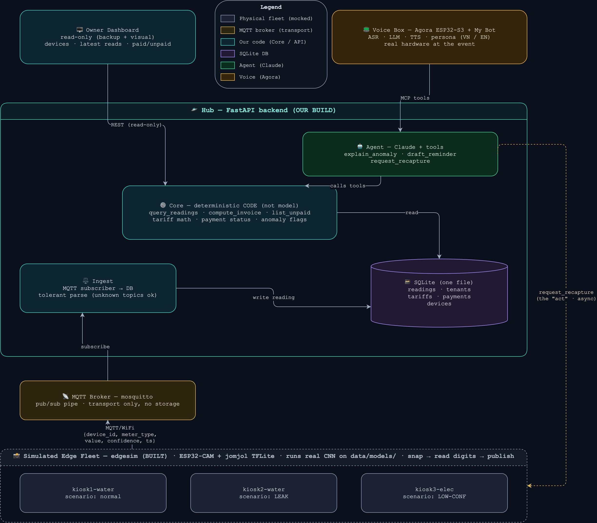

# Architecture — Agentic Edge Meter Fleet

- Source: [`idea.md`](./idea.md).
- Diagrams [`arch.drawio`](./arch.drawio)

---

## The layers (bottom → top)

Readings flow **up**; the agent's answers flow **down**. Data enters at the bottom, the owner asks at the top.

| Layer | What it is | Status |
|---|---|---|
| **Simulated Edge Fleet** | `edgesim` — 3 ESP32-CAM devices, each runs the **real jomjol TFLite CNN** on digit crops, publishes over MQTT. Scenarios: `kiosk1-water` normal, `kiosk2-water` leak, `kiosk3-elec` low-confidence. | **BUILT** |
| **MQTT Broker** | `mosquitto` — a pub/sub **pipe**. Transports readings; stores nothing. No subscriber = the message is gone. | BUILT (compose) |
| **Hub — FastAPI backend** | Our build. Four parts: **Ingest** (MQTT→DB), **SQLite** (one file), **Core** (deterministic code), **Agent** (Claude + tools). | **TO BUILD** |
| **Owner Dashboard** | Read-only page: devices · latest reads · paid/unpaid. Backup + visual while the box talks. | TO BUILD |
| **Voice Box** | Agora ESP32-S3 + My Bot (ASR·LLM·TTS). The owner talks; the agent speaks back. | TO BUILD (real HW) |

### Two storages — don't conflate them

| | Chip SD card | Hub SQLite DB |
|---|---|---|
| Holds | model, config, web files, image/log scratch | readings · tenants · tariffs · payments · devices |
| Scope | one device, local | whole fleet, central |
| Queryable | no | yes — every demo answer comes from here |
| In the sim | collapses to `data/models/` + `data/digits/` | the real build |

The chip is **stateless**: snap → read → publish. It keeps only `pre` (last value, to compute rate). There is **no per-chip database**.

---

## The seam: the Core API

`Core` is a pure-code module (tariff math, invoicing, payment status, anomaly flags). It is the **one contract** the whole system hangs on:

- The **Dashboard** reads it over REST.
- The **Agent** calls it as tools; `explain_anomaly` / `draft_reminder` call Claude *inside* the tool to turn numbers into plain-language Vietnamese.
- The **Voice Box** reaches the same tools through an **MCP server** (thin wrapper over Core).

Freeze the Core API (tool names + JSON in/out) on Day 1. Both engineers build against it. Same discipline that produced [`hub-contract-requirements.md`](../.dk/planning/hub-contract-requirements.md) for the MQTT seam.

---

## The real gap

`edgesim` only produces **readings**. The demo needs **tenants, tariffs, bills, payments, an anomaly** — none exist yet. That gap *is* the build: a data model + Core + agent + **seed data**.

The 5 demo answers need **Core + good data, not the live pipe**. So the P0 spine is seed-DB + Core + agent; live MQTT ingest is a bonus that makes it feel live.

---

## Ownership & build plan (2 engineers, 3 days)

Focus: **A (spine) + Voice/Agora** — Agora is the sponsor, chips in hand. The seam splits the work cleanly; after the Day-1 freeze there is **zero shared state**.

| | **Track A — Software spine** (Khoa) | **Track B — Physical / voice edge** (friend) |
|---|---|---|
| Owns | DB + seed · Core · Agent · REST · Dashboard · **MCP server** | Agora ESP32-S3 flash · My Bot persona · VN-voice check · point My Bot at the MCP endpoint · tune conversation |
| Deliverable to the other | a running **MCP endpoint + tool docs** | — (consumes the endpoint) |
| Stretch | live MQTT ingest (edgesim→DB) | real jomjol meter chip |

Khoa owns everything **down to and including the MCP server**. Friend never touches Python Core — just points Agora at the endpoint URL. Minimal integration surface.

### Day plan

- **Day 1 (both):**
  1. Freeze the **Core API contract** (tool names, args, JSON I/O).
  2. Freeze **seed data** (tenants, tariffs, the leak on kiosk3, a few unpaid tenants) — the demo-script rows drive it.
  3. Khoa ships a **stub MCP endpoint** (fake data) so friend can wire + test immediately.
  4. Friend spikes **the one real risk**: does My Bot accept our MCP server? Is there a VN voice? (Confirm with Agora mentors / Discord.)
- **Day 2:** Khoa — real DB + Core + agent answering all 5 beats over chat/dashboard (**P0 done, demo-safe**). Friend — voice box speaks a real answer through the live MCP endpoint (**P0 wow**).
- **Day 3:** integrate, rehearse the demo script, add P1 (`request_recapture` = the "act"), then live MQTT ingest / real chip if time.

### Priorities (demo-risk order)

- **P0 must-land:** Core + seed + agent answering the 5 script beats via chat/dashboard. Lands even if voice/network die on stage.
- **P0 wow:** the voice box speaks an answer (Track B + the MCP seam).
- **P1:** `request_recapture` (voice → agent → fleet re-reads: the sense→act loop), live MQTT ingest, real meter chip.
