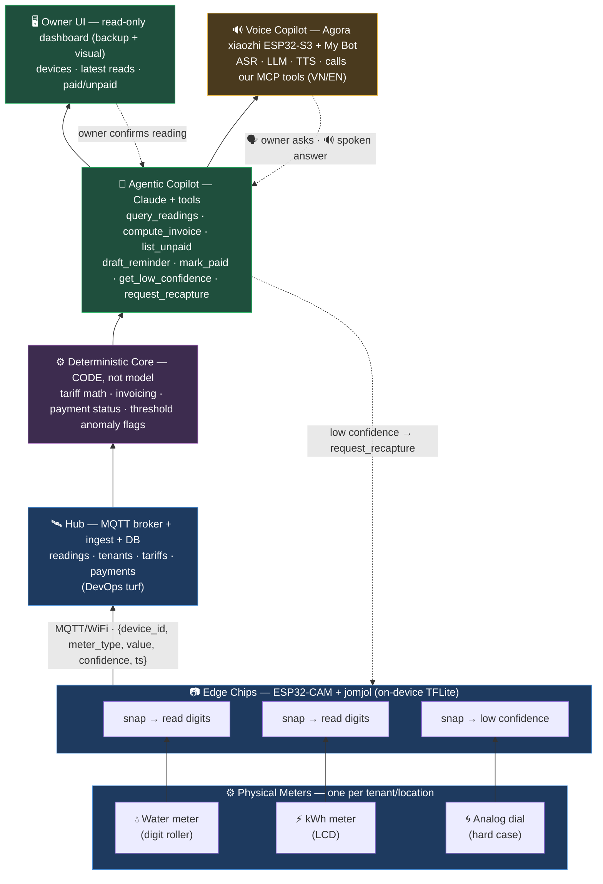
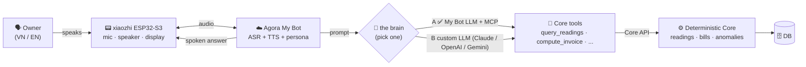

# IDEA.md — Agentic Edge Meter Fleet

> Brainstorm capture for **Agentic AI Build Week (AABW)** — HCMC, July 8–12, 2026.
> Track: **Robotics & Physical AI**. Status: brainstorm in progress, architecture not yet formally signed off.

---

## 1. The foundation: jomjol's AI-on-the-edge-device

Idea: Based on this open source project **https://github.com/jomjol/AI-on-the-edge-device**, which is a tiny (~$10) ESP32-CAM device that **reads an analog/digital meter** — water, gas, electricity. It works by snapping a photo and running a small neural net **on the chip itself** (TensorFlow Lite, no cloud). It extracts the region of interest, recognizes the digits, and publishes the reading over WiFi (MQTT / REST / Home Assistant).

**Why it's the right base:**
- **On-device inference** — a CNN runs on a microcontroller. Textbook **Edge AI / Physical AI**.
- **Closes to the physical world** — reads a real meter face. The "physical" in Physical AI.
- **Pretrained models included** — no ML training needed. Low floor, fits a 5-day hack.
- **Solved problem** — meter-reading vision is done. We don't reinvent it; we build *on top* of it.

**What it does NOT do (our opportunity):**
- It **senses**, it doesn't **reason or act**. One device, one meter, raw number out.
- No fleet management, no billing, no payment tracking, no agent, no owner-facing intelligence.

That gap is the whole project.

---

## 2. Idea: From one device → a fleet + an agentic ops layer

Imagine a business that has many eletric and water meters across different locations that it takes a lot of time and effort to manully record numbers and manage. We can take jomjol's single sensor and build two things on top:

**(a) A fleet of cheap edge devices** — many ESP32-CAMs, one per meter, across multiple locations, all reporting to a central hub

**(b) An agentic AI ops layer** on top of the fleet that automatically does the work a human does today:
- **Measuring** — collect + track each meter's reading over time (no monthly walk-around).
- **Invoicing** — compute each tenant's bill from usage × tariff (now)
- **Payment tracking** — record who has and hasn't paid; chase the late ones (maybe later)
- **Anomaly detection** — spot leaks, spikes, tampering, or misreads and decide what to do.
- **Reporting** — answer the owner in plain language ("who hasn't paid?", "why is kiosk 3 high?").

> Note: in the diagram below, MQTT (Message Queuing Telemetry Transport) is an extremely lightweight, publish-subscribe network protocol designed for machine-to-machine (M2M) and Internet of Things (IoT) communication

---

## 3. Voice copilot on the Agora ESP32-S3 (AABW Physical AI track)

The agentic ops layer (§2) is text-first — a chat box + dashboard. The event provides an **Agora ESP32-S3 device** (a *xiaozhi* 1.54" TFT board — mic, speaker, display, WiFi) plus Agora's **My Bot / ConvoAI** platform (`mybot.sg3.agoralab.co`), which runs **ASR + LLM + TTS** for us. We use one as the **owner's voice interface**: the owner *talks* to a physical box and the agent *speaks back* (Vietnamese / English) — a new channel on top of the Owner-UI layer in the §2 diagram, powered by the same Core tools.

**Two device families — different chips, different jobs:**

| Device | Chip | Role (P1 verbs) | Status |
|---|---|---|---|
| Meter reader | classic ESP32-**CAM** (jomjol) | **see** — read the dial on-chip | simulated fleet (built) |
| Voice copilot | Agora **xiaozhi ESP32-S3** | **listen + speak** — the owner's interface | new — real hardware at the event |

The Agora **S3 cannot run jomjol's meter firmware** (jomjol targets only the classic LX6 CAM), so it
is *never* a meter reader — purely the conversation box. Clean split, no overlap.

**The voice channel:**

**What the owner asks (by voice), answered by the agent:**
- **Measuring** — "kiosk 3 tháng này bao nhiêu?" → latest / tracked readings.
- **Invoicing** — "hóa đơn phòng 2?" → usage × tariff.
- **Payment tracking** — "ai chưa trả tiền?" → who's unpaid (chasing = stretch).
- **Anomaly** — "sao kiosk 3 cao vậy?" → leak / spike / misread explanation.
- **Reporting** — plain-language summaries.

**How the voice box reaches our tools — two options.** Agora's *My Bot* always handles **ASR + TTS**
and the persona/voice; what differs is **where the LLM "brain" lives** — and both paths call the
*same* Core tools underneath.

| | **Option A — Agora LLM + MCP** ✅ *default* | **Option B — bring-your-own-LLM** |
|---|---|---|
| The brain | My Bot's built-in LLM | our agent: **Claude / OpenAI / Gemini** |
| We build | an **MCP server** exposing the Core tools + a system prompt | a **custom LLM endpoint** (OpenAI-compatible) running the agent loop + tools |
| Effort | low — thin MCP wrapper over the Core API | higher — host the agent + endpoint |
| Model control | Agora-managed LLM | we pick the exact model |
| Confirm w/ mentors | the MCP-server field (documented in the guide) | whether My Bot accepts a custom LLM endpoint (not documented) |

Both reuse the **same Core API** — the §2 seam. Option A surfaces it over **MCP**; Option B calls it
inside the agent. **Claude can power the smart bits either way**: even under Option A, tools like
`explain_anomaly` / `draft_reminder` call Claude *inside* the MCP server to turn numbers into
plain-language Vietnamese. Confirm the wiring with the Agora mentors / Discord early — it's the one
real integration risk.

**E2E demo:** a person asks *"who hasn't paid?"*
in Vietnamese, and hears a spoken answer computed from a live (simulated) meter fleet running jomjol's real CNN. **Real voice hardware + real vision model + agentic reasoning** — listen, speak, see, and act, end-to-end.

### What we decided — and why

Four calls that set the scope. Each is chosen to **cut live-demo risk** and play to the Physical-AI
*listen · speak · see · act* story.

- [x] **Voice-first, with a minimal read-only dashboard as backup** — one page (the Owner-UI layer
      from §2: devices · latest reads · paid/unpaid), reading the same Core tools.
      **Why:** live voice fails in the worst place — on stage (network, an accent, a mumble). The
      screen is a visual the judges *see* while the box talks, a fallback if audio dies, and our debug
      tool while building. Nearly free (same Core API) — cheap insurance. One page only; no feature-creep.

- [x] **Read-only answers + exactly one safe action: `request_recapture`** — `draft_reminder` (drafts,
      never sends) as a stretch; **no `mark_paid` by voice** unless behind a spoken confirmation.
      **Why:** the track's fourth verb is *act*, so one action earns that beat — but a voice command
      that mutates money is a misrecognition landmine live. `request_recapture` is harmless, reversible,
      and the best story: voice → agent → the edge fleet re-reads, closing the sense→act loop (§2's
      feedback arrow).

- [x] **Bilingual — English the reliable default, Vietnamese the wow — pending a VN check.**
      **Why:** a Vietnamese-speaking meter copilot is a strong local wow, but the Agora guide only
      confirmed CN/EN/JP, so we don't bet the demo on unverified VN. Day-1 spike: check My Bot's voices
      for Vietnamese. Escape hatch: even on an EN/multilingual voice the *content* is VN, because Claude
      writes the Vietnamese inside the tools (§3, Option A).

- [x] **The demo script is the spec.**
      **Why:** "which capabilities" is fuzzy; a concrete script is the real acceptance criteria — it
      tells Dev A what data to seed, Dev B which tools to expose, and it's what we rehearse.

**Demo script — the north star (doubles as acceptance criteria):**

| # | Judge says | Tool(s) | Priority |
|---|---|---|---|
| 1 | "How much did kiosk 3 use this month?" | `query_readings` | **P0** |
| 2 | "**Why** is kiosk 3 so high?" → "spiked 4× on the 14th — looks like a leak" | `explain_anomaly` (Claude inside) | **P0 — money shot** |
| 3 | "Who hasn't paid?" | `list_unpaid` | **P0** |
| 4 | "What's room 2's bill?" | `compute_invoice` | **P0** |
| 5 | "Ask kiosk 3 to re-read" | `request_recapture` | P1 — the "act" |

Beat #2 is highest value **and** highest risk → **seed the demo dataset** (a leak on kiosk 3, a few
unpaid tenants) so all five answers land.

**Demo de-risk:** the voice demo needs only **Core + good data**, not the full live MQTT hub — a
"**seed the DB**" fast path (sim populates it, or seed directly) keeps both devs unblocked; the hub
stays in the narrative.
